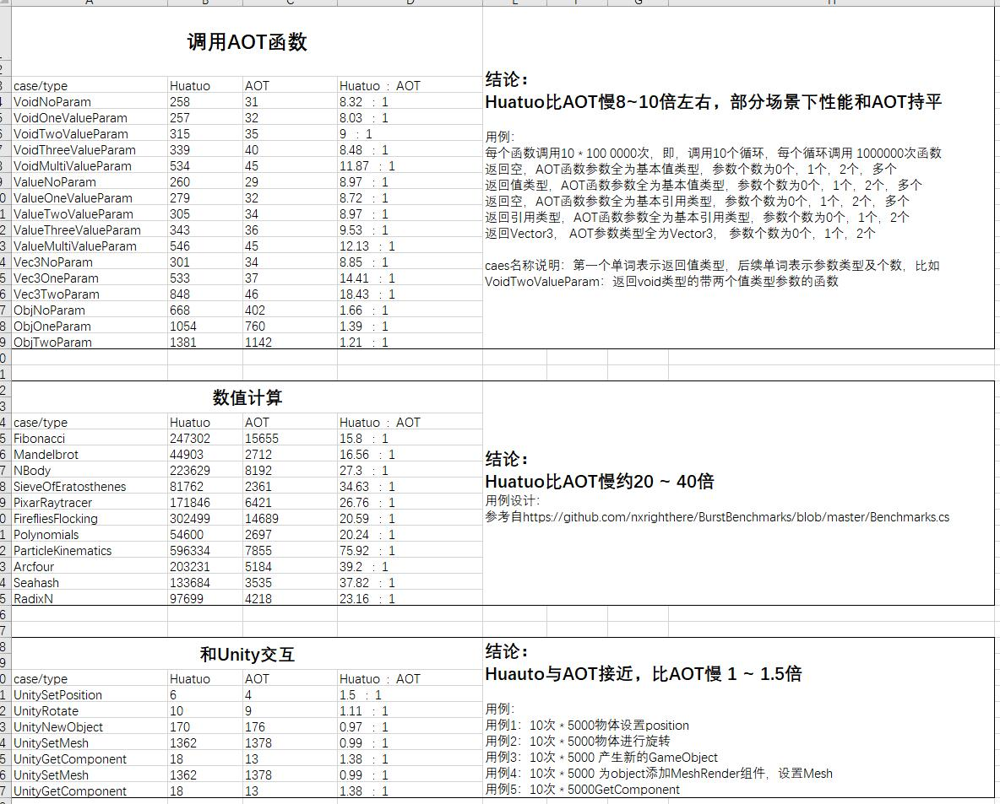

# huatuo 体验项目

一个示例热更新项目。

想了解更多，请加 QQ群: 

- huatuo c#热更新 开发交流群：651188171
- huatuo使用疑难咨询：651188171

你可以使用发布的包来体验huatuo热更新功能。

**示例项目使用 Unity 2020.3.33(任意后缀子版本如f1、f1c1、f1c2都可以) 版本**，需要精确匹配。

## 目录介绍

- Assets Unity项目目录
  - Main AOT主包模块
  - Hotfix 热更新模块

## 使用介绍

huatuo为c++实现，只有打包后才可使用。日常开发在编辑器下，无需打包。

如何打包出一个可热更新的包，请先参阅 [快速开始](https://focus-creative-games.github.io/huatuo/start_up/)。

### 运行流程

本示例演示了如下几部分内容

- 将dll和资源打包成ab
- 多热更新dll，并且按依赖顺序加载它们
- 热更新脚本挂载到热更新资源中，并且正常运行
- 直接反射运行普通热更新函数App::Main

进入场景后，Main场景中的LoadDll会按顺序加载StreamingAssets目录下common AssetBundle里的HotFix.dll和HotFix2.dll，其中HotFix2.dll依赖HotFix.dll。
接着运行HotFix2.dll里的App::Main函数。

注意！多热更新dll不是必须的！大多数项目完全可以只有HotFix.dll这一个热更新模块。纯粹出于演示才故意设计了两个热更新模块。

### 体验热更新

以Win64为例，其他平台同理。

- 安装huatuo （安装huatuo的原理请看 [快速上手](https://focus-creative-games.github.io/huatuo/start_up)）
  - 进入HuatuoData目录
  - 运行 init_huatuo_repos.bat 或 相应 .sh
  - 运行 set_version_xxx.bat 或 相应 .sh。选择与你匹配的版本。如果没有，自己切换到正确的分支。[支持的版本与分支对应关系](https://focus-creative-games.github.io/huatuo/support_versions/)
  - 运行 init_local_il2cpp_data.bat或者相应.sh文件。注意！需要修改脚本，正确设置你的unity安装路径！
- 打包主工程
  - 点击菜单`Huatuo/BuildBundles/Win64`，生成Win64目标的AssetBundle，生成的AssetBundle文件会自动复制到StreamingAssets目录下
  - Build打包 Win64平台的目录
  - 运行，会看到打出 hello, huatuo.prefab
- 更新ab包
  - 修改HotFix项目的PrintHello代码，比如改成打印 "hello,world"。
  - 运行菜单 Huatuo/BuildBundles/Win64，重新生成ab
  - 将StreamingAssets下的ab包同步到打包主工程时Build目标的StreamingAsset目录，在{BuildDir}\build\bin\huatuo_Data\StreamingAssets
- 再将运行，屏幕上会打印"hello,world"。

剩下的体验之旅，比如各种c#特性，自己体验吧。

### Benchmark
AOT用例代码在: [Assets/Main/PerfBenchmark](Assets/Main/PerfBenchmark)</br>
Huatuo用例代码在: [Assets/HotFix/PerfBenchmark](Assets/HotFix/PerfBenchmark)</br>




#### 如何添加用例？
在AOT或Huatuo的用例代码中添加一个类型，按照如下格式编写即可; </br>

```csharp
    [PerfClass("用例名称", "用例分类(比如：Huatuo, AOT)", "用例类型(比如：和Unity交互，数值计算)")]
    public class UnityRotate : IBenchmark
    {
        List<GameObject> objList;
        int frame;
        public void Clear()
        {
            // 用于清理用例数据
            UnityUtils.ReleaseObjects(objList);
        }

        public void Prepare()
        {
            // 用于准备用例数据
            objList = UnityUtils.BuildObjects("Huatuo", nameof(UnityRotate), PerfLevel.unityGameObjectCount);
            this.frame = 10;
        }

        public void Run()
        {
            // 用于执行用例人物
            for (int frameIndex = 0; frameIndex < frame; ++frameIndex)
            {
                for (int i = 0; i < objList.Count; i++)
                {
                    var obj = objList[i];
                    obj.transform.Rotate(Vector3.up, 60 * i);
                }
            }
        }
    }
```
如是写在了其他的assembly中，记得调用
```csharp
Huatuo.Perf.PerfTestFramework.Instance.CollectAllPerfTask(typeof(PerfEntry).Assembly);
```
注册一下你的用例;
运行游戏后，点击 benchmark按钮即可进入benchmark场景，点击"运行所有用例"按钮即可开始测试;
用例运行完成后，报告会自动保存在 **UnityEngine.Application.persistentDataPath + "/huatuo_perf_result.tab"** 中，报告是 "\t"分割的文本文件，可以用Excel打开进行二次数据整理;
