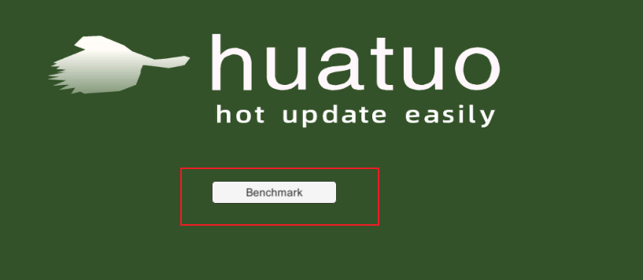
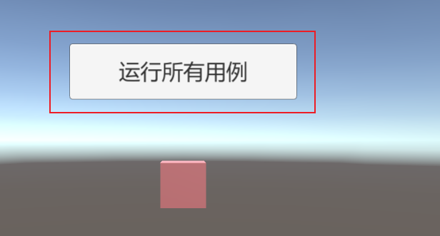

# huatuo 体验项目

一个示例热更新项目，本工程相比[原体验工程](https://github.com/focus-creative-games/huatuo_trial)增加了Benchmark代码。</br>

想了解更多，请加 QQ群: 

- huatuo c#热更新 开发交流群：651188171
- huatuo使用疑难咨询：651188171


**示例项目使用 Unity 2020.3.33(任意后缀子版本如f1、f1c1、f1c2都可以) 版本**，需要精确匹配。

## Benchmark

AOT用例代码在: [Assets/Main/PerfBenchmark](Assets/Main/PerfBenchmark)</br>
Huatuo用例代码在: [Assets/HotFix/PerfBenchmark](Assets/HotFix/PerfBenchmark)</br>


测试用PC硬件指标：
- 处理器：i7-10700K CPU @ 3.80GHz，3792 Mhz
- 内存：64GB

以下是性能测试数据(所有用例均在主线程运行，且不保证用例间运行顺序)


## 如何启动测试？
先按照[原体验工程](https://github.com/focus-creative-games/huatuo_trial)中的说明配置好本地的huatuo，然后进行打包即可(若修改了用例记得重新BuildBundles);</br>
运行游戏后，点击 benchmark按钮即可进入benchmark场景，点击"运行所有用例"按钮即可开始测试;
</br>


用例运行完成后，报告会自动保存在 **UnityEngine.Application.persistentDataPath + "/huatuo_perf_result.tab"** 中，报告是 "\t"分割的文本文件，可以用Excel打开进行二次数据整理;

整个测试时间较长，可自行通过调整 [Assets/Main/PerfBenchmark/PerfTestFramework.cs](Assets/Main/PerfBenchmark/PerfTestFramework.cs) 中 **PerfLevel** 中的参数来减少运行时间

## 如何添加用例？
在AOT或Huatuo的用例代码中添加一个类型，按照如下格式编写即可; </br>

```csharp
[PerfClass("用例名称", "用例分类(比如：Huatuo, AOT)", "用例类型(比如：和Unity交互，数值计算)")]
public class UnityRotate : IBenchmark
{
    List<GameObject> objList;
    int frame;
    public void Clear()
    {
        // 用于清理用例数据
        UnityUtils.ReleaseObjects(objList);
    }

    public void Prepare()
    {
        // 用于准备用例数据
        objList = UnityUtils.BuildObjects("Huatuo", nameof(UnityRotate), PerfLevel.unityGameObjectCount);
        this.frame = 10;
    }

    public void Run()
    {
        // 用于执行用例任务
        for (int frameIndex = 0; frameIndex < frame; ++frameIndex)
        {
            for (int i = 0; i < objList.Count; i++)
            {
                var obj = objList[i];
                obj.transform.Rotate(Vector3.up, 60 * i);
            }
        }
    }
}
```
如是写在了其他的assembly中，记得调用
```csharp
Huatuo.Perf.PerfTestFramework.Instance.CollectAllPerfTask(typeof(Assembly中的类型).Assembly);
```
注册一下你的用例;

